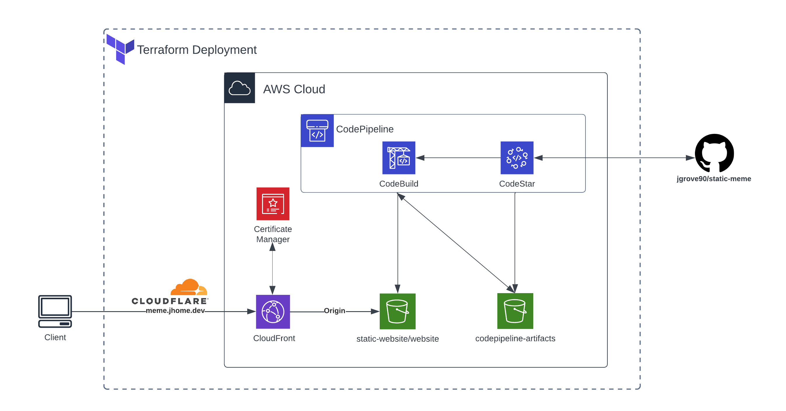

<h1 align="center" style="color:#40A7FF;font-size:28px"><b>Static MEME</b></h1>

<p align="center">
  


<p align="center">
  <a href="#about">About</a> •
  <a href="#aws_diagram">AWS Diagram</a> •
  <a href="#installation">Installation</a> •
  <a href="#improvements">Improvements</a>
</p>


<h2 id="about">About</h2>
<p>This project automates the deployment of a static website on AWS using Terraform. It sets up the necessary infrastructure components such as an S3 bucket for storing website content, CloudFront for content delivery, configuring Cloudflare as a DNS service, and CodePipeline for continuous integration and continuous deployment (CI/CD) from this GitHub repository.</P>

<p>Though I am displaying a meme, this repository is a great starting point to launch a static website in AWS. Whether it be for a portfolio, resume, or a landing page website. I am using CloudFlare as my DNS provider since I use them for my homelab. Route 53 would an alternative if you're looking to use an AWS resource. 

<h3 id="aws_diagram">AWS Diagram</h2>
<p align="center">
</a>  
</p>

<h2 id="installation">Installation</h2>

1. Download and install [AWS CLI](https://docs.aws.amazon.com/cli/latest/userguide/getting-started-install.html).

2. Download and install [Terraform](https://developer.hashicorp.com/terraform/install) .

3. Attach AWS credentials to AWS CLI .
```bash
aws configure
```
4. Create `terraform.tfvars` file to store `cloudflare_api` and `zone_id` token.

5. Run the following Terraform commands.
```bash
terrform init
terraform apply
```
6. To delete resources run.
```bash
terraform destroy
```
<h2 id="improvements">Improvements</h2>

I would store the terraform state file in a s3 bucket for the reasons detailed [here](https://developer.hashicorp.com/terraform/language/state/remote). I would also provide more resources with tags so they can be easily identified in AWS.